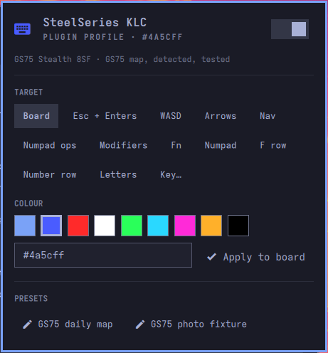

# OmasteelRGB

Per-key RGB for the MSI SteelSeries keyboard, from the Omarchy bar.



Pick a target, pick a colour, apply. Targets are the whole board, a named group (arrows, WASD, F row,
numpad, modifiers and more) or a single key, and they stack: a base colour, groups over it, individual keys
over those. Each layer stays editable on its own, so "make the arrows red" later does not undo "make the
board blue". Colours are steady, many at once, and the controller keeps them in onboard memory after the
shell, the plugin or the machine is gone.

Plugin id `steelseries.keyboard`. MIT licensed.

## Compatibility

The plugin drives the internal SteelSeries KLC controller found in MSI per-key RGB laptops, USB
`1038:1122` and `1038:113a`. It reads the machine's DMI product name, picks the matching keymap and shows
the result at the top of the panel; you can override it there or with
`omarchy-shell steelseries.keyboard setModel GS66`.

| Keymap | Models | Status |
|---|---|---|
| GE63 family, 102 keys | GS75 | Tested with this plugin on a GS75 Stealth 8SF |
| | GE63, GE73, GE75, GS63, GS73, GX63, GT63, GL63 | Same table in msi-perkeyrgb, from user reports there; untested here |
| GS65, 104 keys | GS65 | Family table plus Home and End LEDs, from msi-perkeyrgb; untested here |
| GS66, 105 keys | GS66 | GS65 table plus the power-key LED, from the Bergmann89 fork; untested here |

Any other MSI laptop with the KLC gets the GE63 family table and a warning in the panel. If the keys light in
the right places on yours, open an issue and it joins the list; if not, a new `keymaps/*.json` that
`extends` one of these is the fix. Not supported: zone-based MSI keyboards (three zones, a different
controller), and external SteelSeries Apex keyboards, which the panel detects and reports but does not drive.

If you want one colour across the board with theme sync, the marketplace already lists
[Keyboard RGB](https://github.com/bruno-g-soares/omarchy-keyboard-rgb) for the same controller. OmasteelRGB
is for the many-colours case.

## Requirements

- Omarchy 4 (Quattro).
- Python 3 and the `python-hidapi` package: `omarchy pkg add python-hidapi`. The bridge uses nothing else
  outside the standard library, and nothing is downloaded at install or runtime.

## Install

```bash
omarchy plugin add https://github.com/dreamsgarage/OmasteelRGB.git --enable
```

Then give your session user access to the keyboard's HID node. This is the only privileged step; the
plugin itself never calls sudo or pkexec. The panel shows these exact commands, with a copy button, while
access is missing:

```bash
sudo install -m644 -o root -g root ~/.config/omarchy/plugins/steelseries.keyboard/udev/70-steelseries-klc.rules /etc/udev/rules.d/
sudo rm -f /etc/udev/rules.d/99-msi-rgb.rules     # msi-perkeyrgb's world-writable rule, if present
sudo udevadm control --reload
sudo udevadm trigger --subsystem-match=hidraw --action=add
```

The rule uses `TAG+="uaccess"` with `MODE="0660"`; the comments in the rule file explain why both matter.
Updates: `omarchy plugin update steelseries.keyboard`.

## Before your first write

Enabling the plugin sends nothing to the keyboard. Your keyboard is probably replaying a profile saved from
Windows in onboard memory, and Linux cannot read that profile back. The first colour you apply replaces it
for good. The panel says so and asks once before that write. If you want to keep the Windows look, note it
down or photograph it first; the shipped `gs75-photo` preset is a reconstruction of one such look.

## Use

- Left-click the bar icon for the panel, right-click for lights off, middle-click to restore.
- In the panel: choose Board, a group, or Key… and type a key name (`Esc`, `KP_Enter`, `PrtSc`; suggestions
  appear as you type, case does not matter). Pick a swatch or enter a hex colour, then Apply.
- Presets load a whole map at once. Two ship for the GS75: the daily map and the photo fixture.
- The switch in the header turns the lights off and back on. Off is a stored blackout; on restores the
  last map this plugin wrote.
- Keys while the panel is open: `o` power, `r` restore, `p` photo preset, `b` board target, `e` edit a key,
  `Esc` close.
- Brightness is the chassis `Fn` keys' job; the plugin does not scale colours.

Scripts and keybindings can use the IPC:

```
omarchy-shell steelseries.keyboard status
omarchy-shell steelseries.keyboard off | restore
omarchy-shell steelseries.keyboard preset gs75-custom
omarchy-shell steelseries.keyboard setBase "#4a5cff"
omarchy-shell steelseries.keyboard setGroup arrows "#ff2a2a"
omarchy-shell steelseries.keyboard setKey Esc "#ff2a2a"
omarchy-shell steelseries.keyboard setModel GS66     # or: auto
omarchy-shell steelseries.keyboard models
```

IPC writes skip the panel confirmation; a script is explicit.

## Safety

- Only the steady-colour (`0x0e`) and commit (`0x09`) packets validated on hardware are sent. Hardware
  effects (`0x0b`) are deliberately not implemented: a malformed effect packet bricked a backlight in the
  upstream project.
- Reports are paced the way msi-perkeyrgb does it, and every return value is checked, so a report the
  controller drops is an error in the panel rather than a half-lit board.
- The udev rule grants the active session user only, through `uaccess`. Nothing runs as root.
- State lives in `~/.local/state/omarchy/steelseries-keyboard/` (last written map, model override). The
  plugin does not touch any other configuration.

## Remove

```bash
omarchy plugin remove steelseries.keyboard
```

That deletes the plugin folder and its bar entry. The keyboard keeps whatever map was last written, since the
controller stores it in onboard memory. Optional clean-up:

```bash
sudo rm -f /etc/udev/rules.d/70-steelseries-klc.rules && sudo udevadm control --reload   # the device rule
rm -rf ~/.local/state/omarchy/steelseries-keyboard                                       # saved map and override
```

## How it works

| Path | Role |
|---|---|
| `manifest.json` | Plugin manifest: `kinds: ["bar-widget"]`, entry point `Panel.qml` |
| `Panel.qml` | Bar icon and popup panel |
| `Service.qml` | Owns the bridge process; JSON lines over stdin/stdout, re-reads state after every write |
| `Model.js` | Pure helpers: hex validation, palette, labels, the udev install commands |
| `bridge/` | Python: device and machine detection, keymaps, colour model, KLC HID driver, snapshot, JSON IPC |
| `keymaps/` | Per-model key names, X11 to HID translation and groups. Data, not code; a map can `extends` another |
| `presets/` | Shipped colour maps, listed in the panel |
| `udev/` | The hidraw access rule |
| `tests/` | `python3 -m pytest`; nothing here opens the keyboard |
| `docs/` | Spec, design, acceptance, implementation guide, publish guide |

The protocol is the one msi-perkeyrgb (MIT, Askannz) reverse-engineered: four 524-byte feature reports,
one per keyboard region, then a 64-byte commit. The packet builders are tested byte for byte against
upstream when it is installed. QML never touches HID; the Python bridge does, in a process the shell can
kill on its own.

## Development

```bash
python3 -m pytest -q
rsync -a --delete --exclude .git --exclude '.venv*' --exclude .pytest_cache --exclude __pycache__ \
  ./ ~/.config/omarchy/plugins/steelseries.keyboard/
omarchy restart shell        # after changing a .qml file
```

The shell hot-reloads the plugin directory but keeps serving an already compiled `.qml`, so restart after
QML edits. `omarchy plugin validate` refuses any folder containing a symlink, which a Python virtualenv
has; validate a clean export (`git archive HEAD | tar -x -C /tmp/x`), not the working folder. Shell log:
`journalctl --user _COMM=quickshell`. Release and marketplace steps: [docs/Publish-Guide.md](docs/Publish-Guide.md).
Changes: [CHANGELOG.md](CHANGELOG.md).

## Credits and license

MIT, see [LICENSE](LICENSE). The KLC protocol, keymaps and packet layout come from
[msi-perkeyrgb](https://github.com/Askannz/msi-perkeyrgb) by Askannz (MIT); the GS66 table from the
[Bergmann89 fork](https://github.com/Bergmann89/msi-perkeyrgb).
