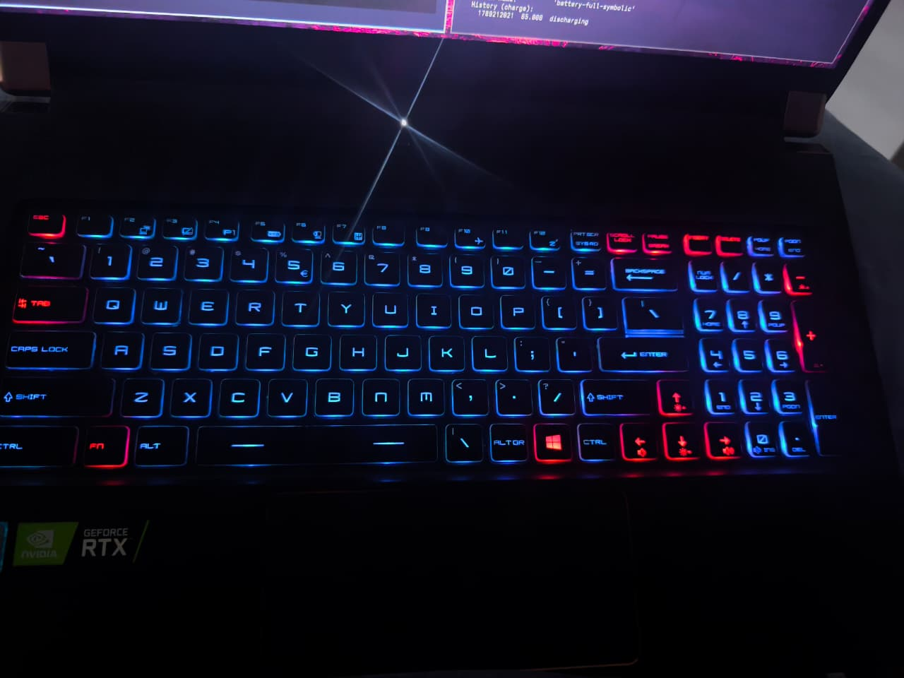

# omastellrgb v1 acceptance

**Status:** approved  
Reference machine: MSI GS75 Stealth 8SF, Omarchy 4.0.3, SteelSeries KLC `1038:1122`.

## Photo fixture

Access confirmed: original file `/home/gaston4kd/Pictures/keyboard.png`. Copy in this repo: [assets/keyboard.png](assets/keyboard.png).



Physical legends are Spanish ISO (Ñ, Alt Gr, €). Software xkb on the reference machine is `us`. Lighting is position-based; the schematic must still be ISO-capable.

This is **not** a WASD-highlight layout.

| Role | Color | Keys |
|---|---|---|
| Base | blue-violet | letters, number row, F-row, Caps, Shifts, Ctrl, Alt, Alt Gr, Space, Enter, Backspace, punctuation, PrtSc, ScrLk, Pause, numpad digits 0–9, numpad Enter / Del |
| Red | red | Esc, Tab, Fn, Windows, arrows, Ins / PgUp / Del / PgDn, Num Lock, numpad `/` `*` `-` `+` |

> `Home` and `End` appear lit in the photo but have **no addressable LED** on this keymap (X11 keycodes 110 / 115
> are absent). They are Fn-layer functions. The `nav` group is 4 keys here, not 6.

Approximate hex (tweakable). **The original `#00b4ff` was wrong** - hardware validation on 2026-09-12 showed the
real profile was blue-violet, and photometric analysis of isolated regions of the photo gives hue 228-235 deg,
not 198 deg. The photo carries a camera blue-cast, so this remains an estimate; the original onboard profile is
unrecoverable. Acceptance should test the **key->color assignment**, not pixel equality with the photograph:

- base `#4a5cff` (corrected - see below)
- red `#ff2a2a`

Machine-readable preset: [../presets/gs75-photo.json](../presets/gs75-photo.json).

```text
all          #4a5cff
nav          #ff2a2a
arrows       #ff2a2a
numpad_ops   #ff2a2a
Esc Tab Fn Super  #ff2a2a
```

A single-color backend (kernel `steelseries::kbd_backlight`) **cannot** pass this fixture.

## Hardware checks (later, when implemented)

- Plugin enable does **not** change the current Windows lighting.
- Applying `gs75-photo` matches the photo: blue-violet base; red Esc/Tab/Fn/Win; red arrows + Ins/PgUp/Del/PgDn; red numpad NumLock/`/`/`*`/`-`/`+`; base-colored numpad digits.
- After a user-chosen map (base + at least one group + one per-key override), those keys match; reboot keeps the map.
- Off then restore returns the plugin map, not a single fill and not a rainbow default.
- Theme switch with sync off: lights unchanged.
- Theme switch with sync on: base follows `keyboard.rgb`; groups/overrides remain unless the user chose paint-entire-board.
- Typing, Fn combos, and touchpad unaffected.
- `omarchy plugin validate` and `omarchy plugin enable steelseries.keyboard` succeed.
- If OmaRGB is installed later, KLC is not double-driven.

## Probe facts from the reference machine

These were collected before the spec was approved and must still hold:

- DMI product: GS75 Stealth 8SF, board MS-17G1, SKU 17G1.1
- USB: `SteelSeries ApS SteelSeries KLC` `1038:1122`, firmware 2.31, two HID interfaces, USB Full Speed, 300 mA
- HID driver: `hid-generic` (not `hid-steelseries`)
- hidraw: `/dev/hidraw0` and `/dev/hidraw1`, `root:root 600`
- No `/sys/class/leds/*kbd_backlight*`
- Discrete NVIDIA GPU powered off for battery; that is unrelated to keyboard lighting

## Validation results — 2026-09-12

Run on the reference machine with `msi-perkeyrgb 2.1` (AUR), the upstream CLI that implements the KLC protocol.
Config: [../presets/perkeyrgb/gs75-photo.conf](../presets/perkeyrgb/gs75-photo.conf).

```
sudo msi-perkeyrgb --model GS75 -c presets/perkeyrgb/gs75-photo.conf
```

| Claim under test | Result |
|---|---|
| GE63-family keymap is correct for the GS75 | **PASS** — colors landed on the intended keys, not shifted neighbours |
| Per-key multi-color in one profile | **PASS** — two colors simultaneously |
| `gs75-photo` is representable and writable | **PASS** — 102/102 keymap entries addressed |
| Numpad digits stay on base while `numpad_ops` goes red | **PASS** |
| Typing / Fn combos / touchpad unaffected | **PASS** — RGB and input are separate HID interfaces |
| Base hex `#00b4ff` | **FAIL** — real profile was blue-violet; corrected to `#4a5cff` |
| `nav` group as 6 keys | **FAIL** — `Home` / `End` have no addressable LED; group is 4 keys |
| udev rule `GROUP="input"` | **FAIL** — reference user is not in `input`; switched to `TAG+="uaccess"` |

Incidental finding: **msi-perkeyrgb crashes on blank lines in config files.** In `config.py`,
`line.replace(" ", "")[0]` is evaluated before the empty-line guard, raising `IndexError`. Generated configs
must contain no blank lines. Unfixed upstream since 2019.
